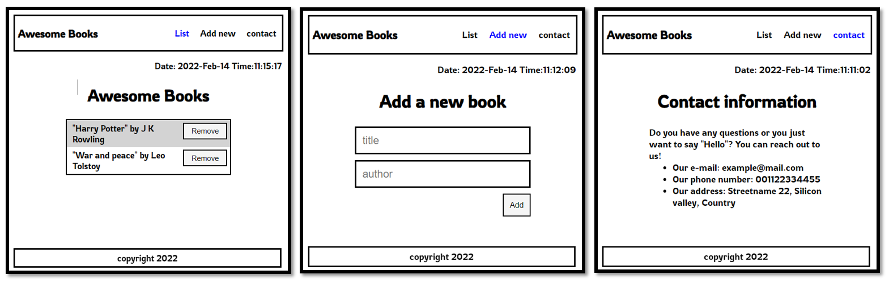

# Portfolio
My personal portfolio

> I am going to create my first repoitory of Microverse program on github. It's going to be fun.

Additional description about the project and its features.

## Built using

- HTML
- CSS
- Javascript (ECMA6)
- NPM

## Live Demo

[Live Demo Link](https://behnam1369.github.io/Awesome-Books/)

## Authors

👤 **Behnam Aghaali**

- GitHub: [https://github.com/Behnam1369](https://github.com/Behnam1369)
- LinkedIn: [https://www.linkedin.com/in/behnam-aghaali-62561375](https://www.linkedin.com/in/behnam-aghaali-62561375)
- Twitter: [https://twitter.com/behnamagh1369](https://twitter.com/behnamagh1369)
- Email: [behnam.aghaali@yahoo.com](mailto:behnam.aghaali@yahoo.com)

## 🤝 Contributing

Contributions, issues, and feature requests are welcome!

Feel free to check the [issues page](../../issues/).

## Show your support

Give a ⭐️ if you like this project!

## Acknowledgments

- Hat tip to anyone whose code was used
- Inspiration
- etc

## 📝 License

This project is [MIT](./MIT.md) licensed.

